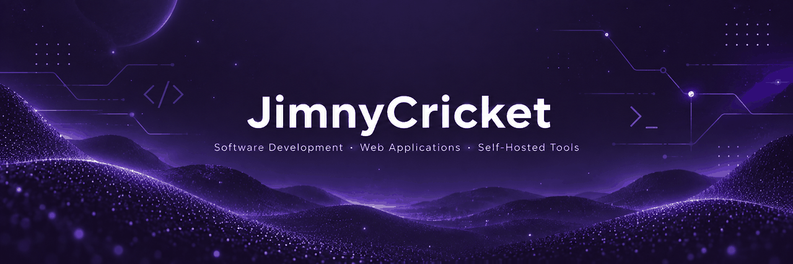
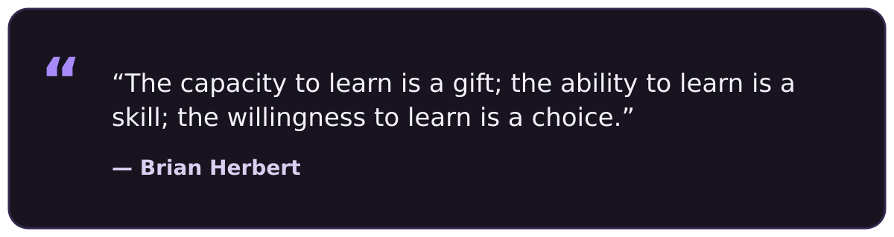
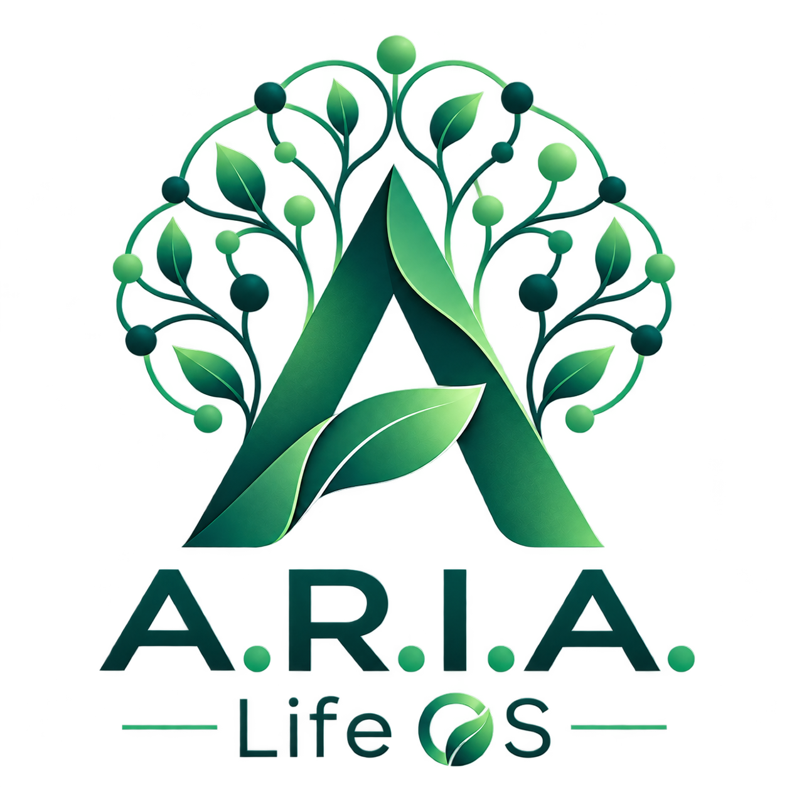
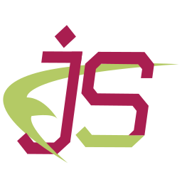
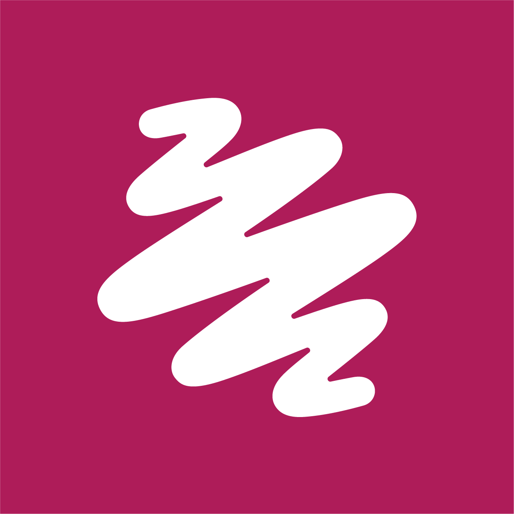
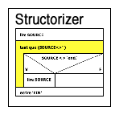

  

  

  

  

## About Me

Hi, I'm Christian — also known as **JimnyCricket**.

As an **IT Specialist for Application Development**, I develop software and web projects with a focus on practical solutions for real-world requirements — from web applications and self-hosted tools to custom software and automation.

Alongside my own development projects, I build and maintain web projects through **CricketCode Web Solutions**. Many of my projects are based on real-world requirements and give me the opportunity to explore new technologies and apply them in practice.

 

  

## Learning & Exploring

### My Development Journey

`Website Builders` → `CMS & WordPress` → `Web Development` → `Application Development` → `APIs & Automation` → `Software Architecture`

### Currently Exploring

  
  
  
  

  

## Experience & Education

<table>
<tr>
<td width="20%" valign="top">

### Jun 2024 – Present

</td>
<td width="80%" valign="top">

### CricketCode Web Solutions

**Owner & IT Specialist for Application Development**

Web development, custom software solutions and technical implementation of digital projects.

</td>
</tr>

<tr>
<td valign="top">

### Jan 2023 – Jan 2025

</td>
<td valign="top">

### Fachinformatiker für Anwendungsentwicklung (IHK)

**GFN GmbH**

Professional training in application development with a focus on software development, programming, databases, web technologies and software engineering.

</td>
</tr>
</table>

  

## Current Project

<table>
<tr>
<td width="38%" valign="middle" align="center">

</td>

<td width="62%" valign="top">

### A.R.I.A. – Life OS

A personal **AI-powered Life OS and Second Brain** designed to bring knowledge, projects, tasks and digital workflows together in one central workspace.

A.R.I.A. combines an adaptive dashboard with a local AI assistant, a Markdown-based knowledge system, RAG-powered retrieval and automation tools — creating a personal digital environment for organizing information, solving problems and supporting everyday work.

  
  
  
  

**Tech Stack**

  
  
  
  
  
  
  

</td>
</tr>
</table>

## Other Projects

### RecordRanger!

A modern, self-hostable collection manager for vinyl record enthusiasts.

  
  

 

--- 

### BookmarkRanger!

A modern, self-hostable manager for bookmarks and code snippets.

  
  
  

 

---

### VHSRanger!

A self-hosted collection manager for your VHS tape collection.

  
  

 

---

### MidiRanger!

A self-hostable MIDI library manager and player, controllable from any browser on your network.

  
  
  
  

  

## Tech Stack

A selection of the technologies and tools I use across software development, web projects and self-hosted applications.

| **Category** | **Technology** | **Description** |
| :--- | :--- | :--- |
| **Programming Languages** |  | Java, Python, JavaScript, TypeScript and PHP for application development, web projects, backend services and automation. |
| **Markup, Styling & Templating** |  &nbsp;  | HTML, CSS and EJS for structure, styling and server-side templating. |
| **Frontend & UI** |  | React, Tailwind CSS and Bootstrap for component-based and responsive user interfaces. |
| **Backend & APIs** |  | Django and FastAPI for backend services, application logic and REST APIs. |
| **Databases** |  | MySQL, PostgreSQL and SQLite for relational data storage across different projects. |
| **Desktop Applications** |  | Tauri for lightweight desktop applications built with modern web technologies. |
| **AI & Knowledge Systems** |  | Ollama, RAG and Obsidian for local AI, retrieval-augmented generation and Markdown-based knowledge systems. |
| **CMS** |  | WordPress for websites, custom themes, plugins and content-driven projects. |
| **Planning & Prototyping** |  &nbsp;  &nbsp;  | Excalidraw, Balsamiq Wireframes and Structorizer for diagrams, wireframes, application concepts and algorithm modeling. |
| **Development Environments** |  | Visual Studio Code and IntelliJ IDEA as development environments depending on language and project. |
| **Version Control** |  | Git and GitHub for source control, repository management and project collaboration. |
| **Infrastructure & Self-Hosting** |  &nbsp;  | Docker, Linux and Unraid for containers, Linux environments and self-hosted infrastructure. |

  

## GitHub Activities

&nbsp;&nbsp;

&nbsp;&nbsp;

  

## Support

I don't drink coffee — so if one of my projects is useful to you, you can support my work with a bottle of water instead. 💧

  

  

---

**Learn · Build · Explore · Improve**

 

